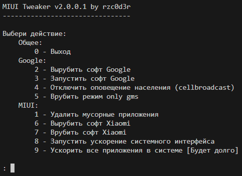

# MIUI-Tweaker
MIUI-Tweaker - Script for root users of MIUI, also suitable for others, but will be less useful tweaks

### Preview of the project in English


### Preview of the project in Russian


# How to use

1. You need a rooted device!

2. Install [Pydroid3 IDE](https://play.google.com/store/apps/details?id=ru.iiec.pydroid3), [Pydroid3 Permissions Plugin](https://play.google.com/store/apps/details?id=ru.iiec.pydroidpermissionsplugin)

3. Open the Pydroid3 IDE configure it, then open my project file and run it. You will need to allow access to root in your root manager. 

4. Done! Now navigate through the menu by entering numbers using the prompts in the console

# How to customize the program
In the **main.py** file you can see 4 lists with applications:
- ```remove_list``` - these applications will be removed by any means possible (action 1)
- ```google_list``` - these applications will be turned on and off (actions 3 and 2)
- ```google_gms```  - these applications will be turned on and off (action 5)
- ```xiaomi_list``` - these applications will be turned on and off (actions 7 and 6)

Example: we see a list of ```google_gms``` in front of us:
```python
google_gms = [ # these applications will be turned on and off in step 5
    'com.android.vending',
    'com.google.ar.core',
    'com.google.android.ims',
    'com.google.android.onetimeinitializer',
    'com.google.android.apps.googleassistant',
    'com.google.android.googlequicksearchbox',
    'com.google.android.apps.subscriptions.red',
    'com.google.android.apps.tachyon',
    'com.google.android.apps.docs',
    'com.google.android.apps.maps',
    'com.google.android.gm',
    'com.google.android.apps.walletnfcrel',
    'com.google.android.calendar',
    'com.google.android.youtube',
    'com.google.android.projection.gearhead',
    'com.google.android.apps.wellbeing',
    'com.google.android.apps.turbo'
]
```

And I want to remove [**Google Maps**, **Google App**, **YouTube**] from this list, I take and delete the line [**com.google.android.android.apps.map**, **com.google.android.googlequicksearchbox**, **com.google.android.youtube**] and I get this:
```python
google_gms = [ # these applications will be turned on and off in step 5
    'com.android.vending',
    'com.google.ar.core',
    'com.google.android.ims',
    'com.google.android.onetimeinitializer',
    'com.google.android.apps.googleassistant',
    'com.google.android.apps.subscriptions.red',
    'com.google.android.apps.tachyon',
    'com.google.android.apps.docs',
    'com.google.android.gm',
    'com.google.android.apps.walletnfcrel',
    'com.google.android.calendar',
    'com.google.android.projection.gearhead',
    'com.google.android.apps.wellbeing',
    'com.google.android.apps.turbo'
]
```

For second example, I want to add **Google Classroom** aka **com.google.android.apps.classroom** to the ``google_gms`` list:
```python
google_gms = [ # these applications will be turned on and off in step 5
    'com.android.vending',
    'com.google.ar.core',
    'com.google.android.ims',
    'com.google.android.onetimeinitializer',
    'com.google.android.apps.googleassistant',
    'com.google.android.apps.subscriptions.red',
    'com.google.android.apps.tachyon',
    'com.google.android.apps.docs',
    'com.google.android.gm',
    'com.google.android.apps.walletnfcrel',
    'com.google.android.calendar',
    'com.google.android.projection.gearhead',
    'com.google.android.apps.wellbeing',
    'com.google.android.apps.turbo',
    'com.google.android.apps.classroom'
]
```

### The main thing is to observe the syntax that the name of the package should be in quotes and also after the end quote you should write **,**

# Useful Information
1. The program has two locales: **Russian** and **English**. If the system language is **UK** or **RU**, the **RU-locale** is enabled. Otherwise, the **EN-locale** is used.
2. What is **gms only mode** - it is a mode in the program that disables the application from the ```google_gms``` list, but leaves **com.google.android.gms** enabled (To avoid unnecessary problems associated with disabling Google Play Services disabled).
