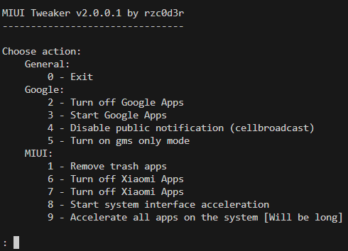

# MIUI-Tweaker
MIUI-Tweaker - Script for root users of MIUI, also suitable for others, but will be less useful tweaks

# How to use

1. You need a rooted device!

2. Install [Pydroid3 IDE](https://play.google.com/store/apps/details?id=ru.iiec.pydroid3), [Pydroid3 Permissions Plugin](https://play.google.com/store/apps/details?id=ru.iiec.pydroidpermissionsplugin)

3. Open the Pydroid3 IDE configure it, then open my project file and run it. You will need to allow access to root in your root manager. 

4. Done! Now navigate through the menu by entering numbers using the prompts in the console

# Useful Information
1. The program has two locales: **Russian** and **English**. If the system language is **UK** or **RU**, the **RU-locale** is enabled. Otherwise, the **EN-locale** is used.
